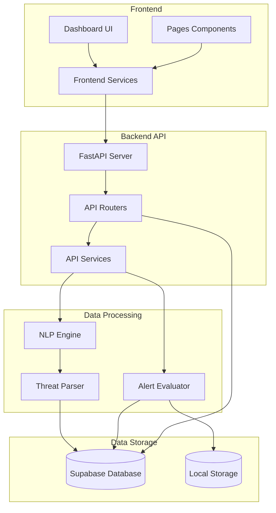
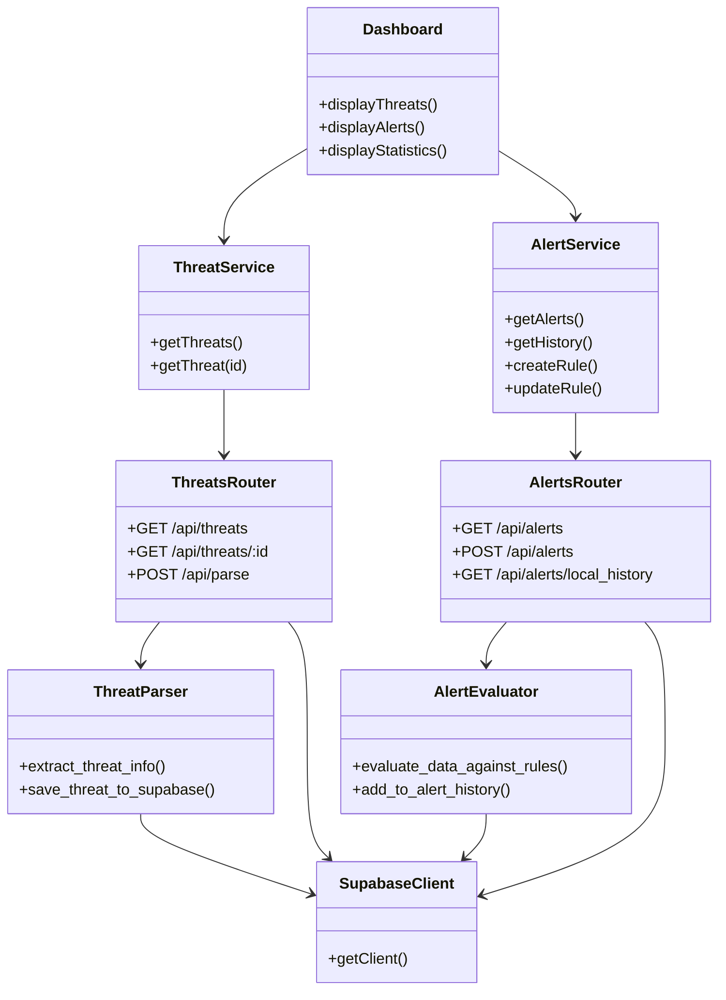
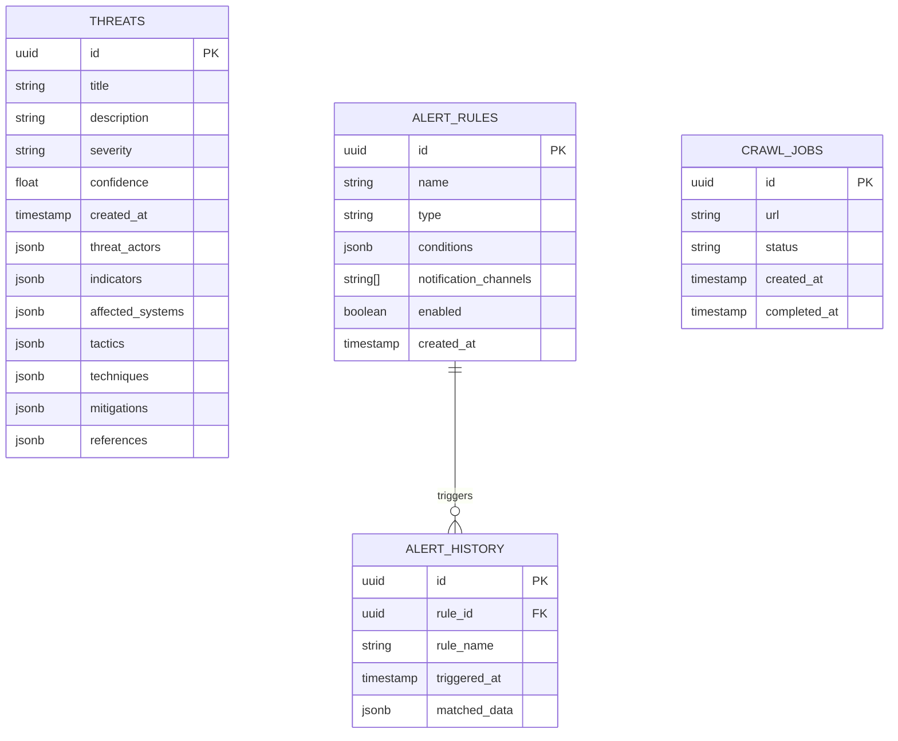
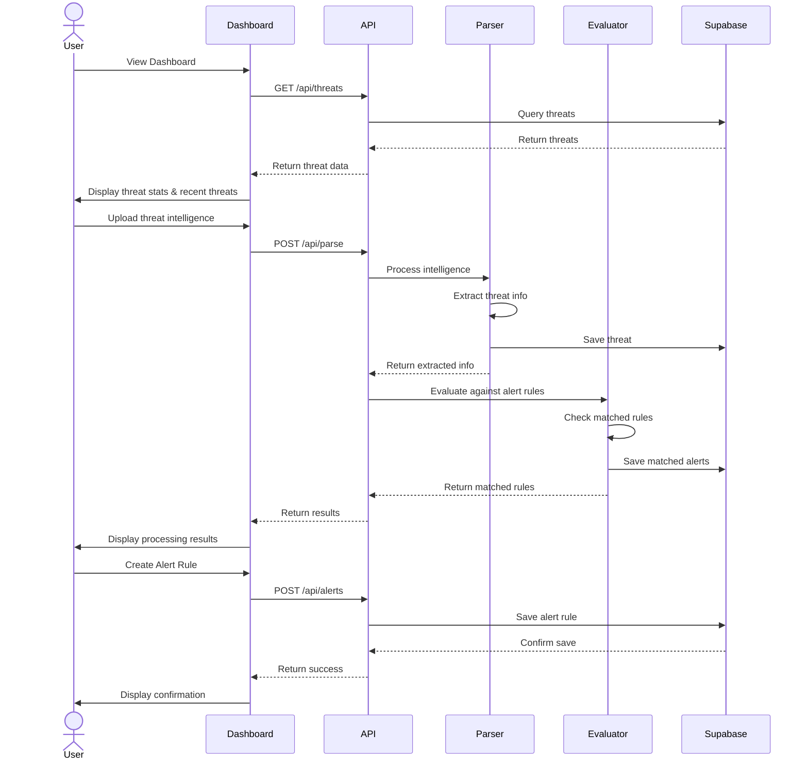
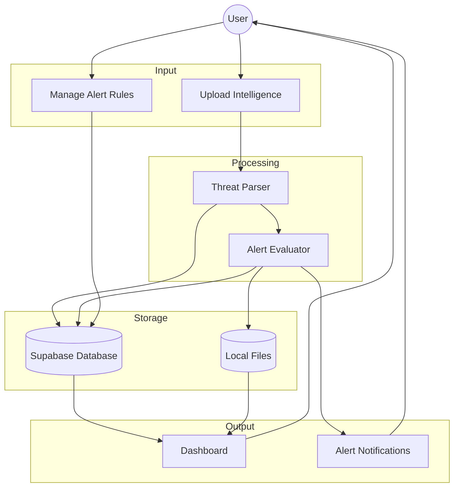
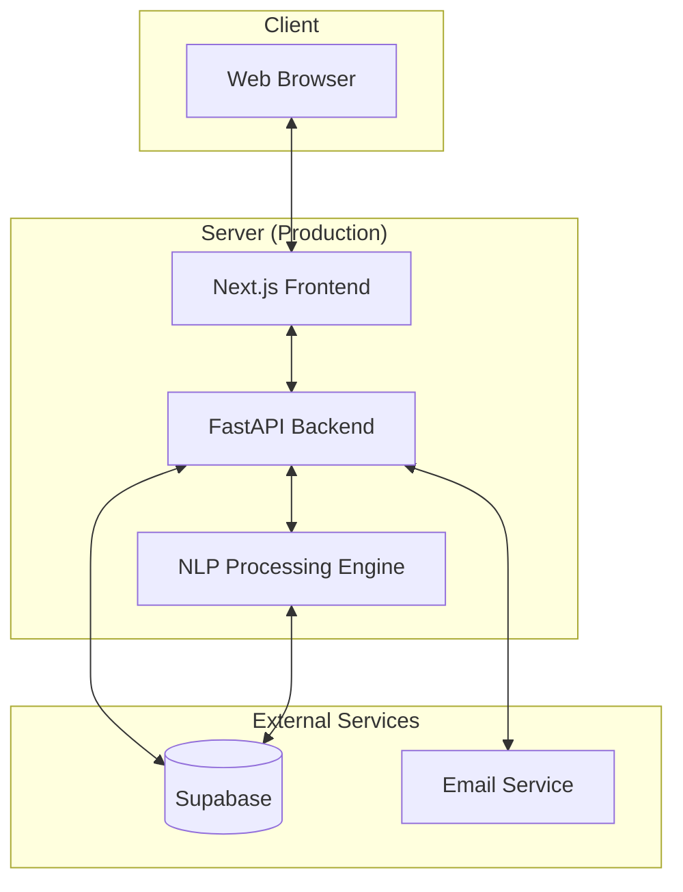
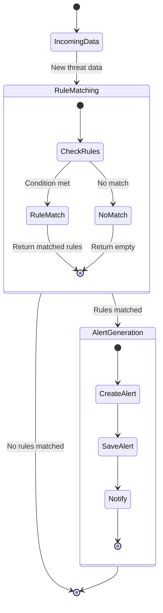

# SEER System Diagrams

This document contains various diagrams representing the SEER cybersecurity monitoring system's architecture, components, and user flows.

## System Architecture Diagram

## Component Diagram

## Database Schema

## User Flow Diagram

## Data Flow Diagram

## Deployment Architecture

## Alert Evaluation Flow

